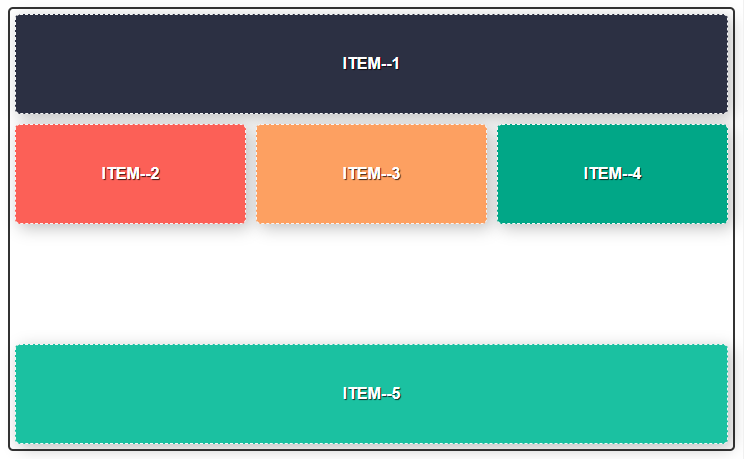

## 준비하기

### 컨벤션 설정

`vue cli`로 프로젝트 생성 후, `prettier`와 `esLint`를 적용했다면 `vue cli`에서 생성한 프로젝트의 코딩 컨벤션이 현재 적용한(prettier, esLint) 컨벤션과 다르기 때문에 `npm run serve`를 실행하면 여러 종류의 프리티어 에러 메시지를 출력하게 되면서 정상적으로 실행되지 않을 수 있다.

프로젝트 전체 파일에 대해서 한번에 오류를 정리하는 방법은 아래의 커맨드를 사용하면 좋다.

```json
"scripts": {
  "prettier:write": "prettier --write \"src/**/*.{js,vue,scss}\""
},
```


## 그리드와 플렉스

`display: grid`는 2차원 레이아웃 시스템을 바탕으로 한다. `그리드 컨테이너`에서 하위 `그리드 아이템`에 대한 스타일을 정의할 수 있다.

```scss
.container--grid {
  display: grid;
  grid-template-columns: repeat(5, 250px);
  grid-template-rows: 150px;
  gird-gap: 30px;
}
```

`display: flex`는 일차원 레이아웃 시스템을 바탕으로 한다. 위의 스타일을 플렉스를 사용해서 외관적으로 동일하게 표현하려면 아래와 같다. 플렉스 컨테이너에 영향을 받는 `플렉스 아이템`은 자신을 표현할 때 3가지 상태로 정의할 수 있다.

- flex-grow: 자신이 차지할 공간의 정도를 결정. 기본값은 `0`이다. 소수점이나 양의 정수로 증감을 표현할 수 있다. (예를 들어 0.1 또는 2 처럼 선언)
- flex-shrink: 컨테이너 크기에 맞추어 자신을 축소할지를 결정 (0: 축소하지 않음, 1: 축소함)
- flex-basis: 플렉스 아이템의 기본 크기를 정의. 컨테이너에서 정의된 `flex-direction` 속성에 따라 높이와 너비로 평가된다.

위의 속성은 축약해서 `flex: flex-grow | flex-shrink | flex-basis`와 같이 선언할 수 있다.

```scss
.container--flex {
  display: flex;
  // flex-direction: row;
  // flex-wrap: nowrap;
  flex-flow: row nowrap; // Short-hand
}

.item {
  margin: 0 (30px / 2);
  flex: 0 0 250px;
  width: 250px;
  height: 150px;

  &:first-of-type {
    margin-left: 0;
  }

  &:last-of-type {
    margin-right: 0;
  }
}
```

### 그리드와 플렉스의 차이

그리드는 `그리드 라인`으로 열과 행을 만들고 그것을 채우는 가상의 `셀`을 그리드 영역으로 사용하여 2차원적으로 다양한 레이아웃을 표현할 수 있다. 반면에 플렉스는 x축이나 y축으로 아이템을 연속적으로 정렬하고 어떻게 공간을 채울지에 대한 1차원적인 레이아웃을 표현하는데 차이가 있다.

### 그리드 속성의 사용

콘텐츠가 동적으로 표현된다면 그리드 아이템 갯수를 파악하기 어려울 수 있다. 고정값 대신에 `grid-auto-{rows, columns}` 속성을 사용해서 컨테이너 표현될 아이템을 유연하게 정의할 수 있다.

```scss
.container--grid {
  display: grid;
  grid-template-columns: repeat(5, 1fr);
  grid-auto-rows: minmax(auto, 100px);
}
```

- fr(fraction unit): 화면을 나누는 단위. 공간 비율을 분수로 나타낸다.
- minmax(최소값, 최대값): 최소값 최대값을 통해서 크기를 지정할 수 있다.

그리드 아이템에 `grid-{row, column}` 속성을 사용하면 자유롭게 레이아웃을 표현할 수 있다. 속성 값의 앞자리는 시작 위치, 뒷자리는 종료 위치를 나타낸다. (행과 열의 시작 값은 1부터 시작된다.)

```scss
.item {
  &--1 {
    // grid-colum-start: 1;
    // grid-colum-end: 4;
    grid-column: 1 / 4; // Short-hand
  }

  &--4 {
    grid-column: 4 / 6;
    grid-row: 3 / 5;
  }
}
```


`auto`와 `span` 값을 사용해서 레이아웃의 표현을 정의된 규칙에 따라 배치하도록 설정할 수 있다.

```scss
.container {
  gird-template-columns: repeat(auto-fill, minmax(33.33%, auto));
  gird-template-rows: repeat(4, minmax(auto, 100px));
}

.item {
  &:nth-of-type(1) {
    grid-column: auto / span 3;
  }

  &:nth-of-type(2) {
    grid-column: auto / span 2;
  }

  &:nth-of-type(5) {
    grid-column: auto / span 3;
  }
}
```

시작 값은 자동으로 계산되게 정의했지만 종료 값을 span 값을 통해 일정 수치만큼 지정했기 때문에 그리드 아이템이 해당 값에 정의된 크기 만큼의 공간을 확보해야 됨으로 5번째 아이템의 경우 개행 후에 레이아웃을 그리게 된다.

이외에도 `grid-auto-flow` 속성을 정의해서 그리드 아이템의 흐름을 전체적으로 제어할 수도 있다. `dense` 값을 추가로 정의하면 흐름의 방향에 따라 빈 공간이 없도록 정렬한다.

```scss
.container {
  grid-auto-flow: row dense;
}
```

### 그리드 영역을 이름으로 정의하는 방법



그리드 영역을 이름으로 정의하려면 아래와 같은 방법으로 레이아웃 표를 작성하면 된다.

```scss
.container {
  grid-template-areas:
    'header header header'
    '   a    main    b   '
    '   .     .      .   '
    'footer footer footer';
}

.item--1 {
  grid-area: header;
}
```

위와 같이 그리드 아이템에 레이아웃 표에서 사용한 이름을 매칭시키면 자동으로 영역을 그린다.

### 아이템 정렬하기

그리드 아이템 정렬도 플렉스 컨테이너에서 사용하던 동일한 속성을 적용해서 표현할 수 있다. align 속성은 세로 방향의 정렬을 정의하며 justify 속성은 가로 방향의 정렬을 정의한다. items과 content는 앞서 설명한 속성이 적용될 때, 두 줄 이상의 아이템이 있을 때 컨테이너 중심으로 아이템을 정렬하거나(content) 또는 진행 방향의 흐름의 중심 축을 따라 정렬한다. (items)

```scss
// align-items: center;
// justify-items: stretch;
place-items: center stretch; // Short-hand

// align-content: center;
// justify-content: space-between;
place-content: center space-between; // Short-hand

// 개별 아이템 정렬 속성
align-self: stretch;
justify-self: space-between;
```

그리드 아이템에서 `order` 속성으로 아이템의 배치 순서를 변경할 수 있다. 시각적인 표현이고 구조적으로 변경되는 것은 아니다.

```scss
// 두번째 `.item--2`이 처음에 시작되도록 order 순서를 1(첫번째)로 선언했다.
.item {
  &--1 {
    order: 2;
  }

  &--2 {
    order: 1;
  }
}
```

### 크로스 브라우징

모던 브라우저에서 플렉스와 그리드 레이아웃을 지원하고 있지만 IE(인터넷 익스플로러)의 경우에는 아직 미지원되는 부분이 있기 때문에 플렉스와 그리드 시스템을 사용한 레이아웃을 표현할 때는 주의가 필요하다. `can i use`와 `mdn` 문서를 통해서 브라우저 지원 범위를 잘 살펴보고, postCSS와 autoprefixer를 사용한 크로스 브라우징 전략을 사용하도록 한다.

## 오류 해결하기

- **module' is not defined.eslint no-undef**

  `.eslintrc.js` 파일에 아래 내용을 추가해서 `"node": true` 노드 환경임을 선언한다.

  ```json
  "env": {
    "browser": true,
    "amd": true,
    "node": true
  }
  ```

- **scss 컴파일하기**

  ```
  npm install -D sass-loader sass
  ```

  sass 문법과 scss 문법을 잘 가려서 스타일 태그에 선언한다.

  ```html
  <style lang="scss" scoped>
    /* ... */
  </style>
  ```

- **에디터에서 줄바꿈을 오류로 인식 한다면**

  - CR: Carriage Return
  - LF: Line Feed

  `.gitattributes`가 알 수 없는 실수로 유실되면서 발생한 이슈였다. LF 형태로 바꾸면 안되고, 깃 속성 파일을 생성하거나 잘 보존해서 해결하자. 그리고 추가로 eslint 규칙에서 프리티어 endOfLine 속성을 auto로 설정한다.

  - https://stackoverflow.com/questions/170961/whats-the-best-crlf-carriage-return-line-feed-handling-strategy-with-git

```js
// .eslint.js
rules: {
  'prettier/prettier': [
    'error',
    {
      endOfLine: 'auto'
    }
  ]
}
```

## Reference

- [Read: understanding-css-grid](https://medium.com/sketch-app-sources/understanding-css-grid-ce92b7aa67cb)
- [Read: 이번에야말로 CSS Grid를 익혀보자](https://studiomeal.com/archives/533)
- [Link: grid-examples](https://gridbyexample.com/examples/)
- [Read: grid](https://developer.mozilla.org/ko/docs/Web/CSS/grid)
- [Read: flex](https://developer.mozilla.org/ko/docs/Web/CSS/flex)
- [Link: caniuse/grid](https://caniuse.com/#search=grid)
- [Read: a-guide-to-flexbox](https://css-tricks.com/snippets/css/a-guide-to-flexbox/)
- [Read: ie에서-css-그리드-사용하기-css-그리드와-autoprefixer](https://webactually.com/2018/10/ie%EC%97%90%EC%84%9C-css-%EA%B7%B8%EB%A6%AC%EB%93%9C-%EC%82%AC%EC%9A%A9%ED%95%98%EA%B8%B0-css-%EA%B7%B8%EB%A6%AC%EB%93%9C%EC%99%80-autoprefixer/)
- [Link: cssgridgarden](https://cssgridgarden.com/#ko)
